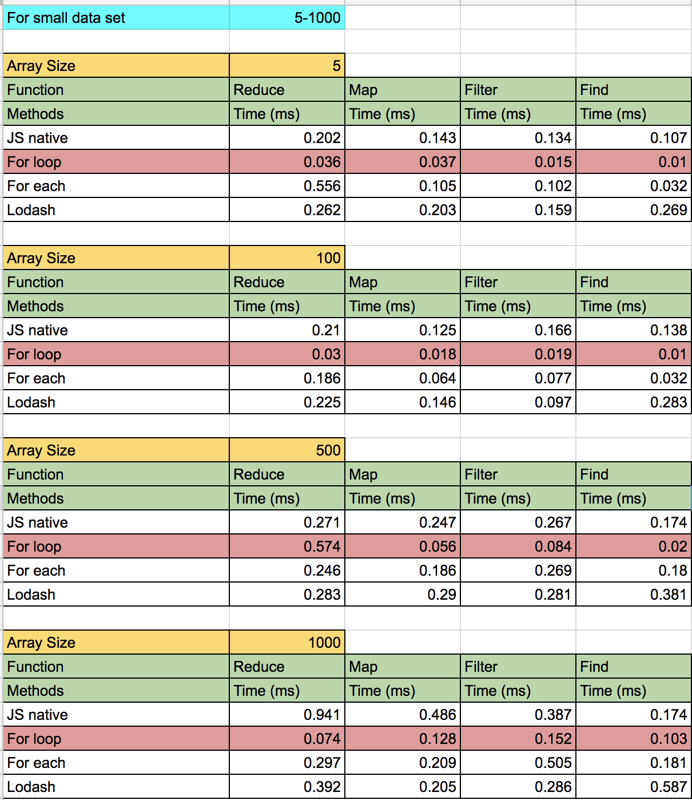
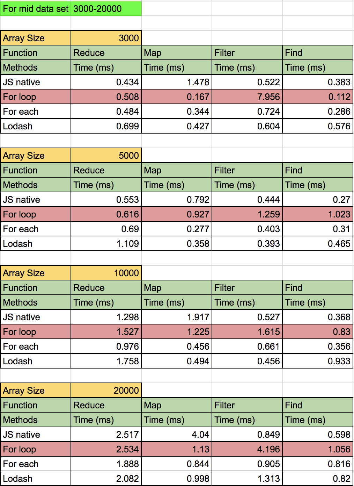

# Performance-analysis
Javascript array methods map,reduce,filter,find vs for loop vs vs for each vs lodash vs ramda methods for basic operations and heavy data manipulations, to analyze the execution speed.

### To run 
 1. Run npm install
 2. For small data set performance report `npm run t:s`
 3. For large data set, Generate Run `npm run seed 10000`, here 10000 is size of array, default is 100000
 4. For large data set performance report `npm run t:l`

 To test your own function create them in formulas file 
    
### Results for small data set of array size 5 - 1000 

### Results for mid data set of array size 3000 - 20000

### Results for large data set of array size 50000 - 1000000

### Coming soon
1. Caching (inline, warm) considerations
2. GC considerations

### Note
1. These results are computed using Node V8 v5.8.283.41
2. These result does not consider the JIT, inline caching, hidden classes, deoptimizations, garbage collection, pretenuring etc.
3. Result may vary as per env's.
4. Red colour highlight in the above images is just for reference, will soon change.

### Discussion/Posts
1. https://news.ycombinator.com/item?id=17050798
2. https://medium.com/@ideepak.jsd/javascript-performance-test-for-vs-for-each-vs-map-reduce-filter-find-32c1113f19d7

